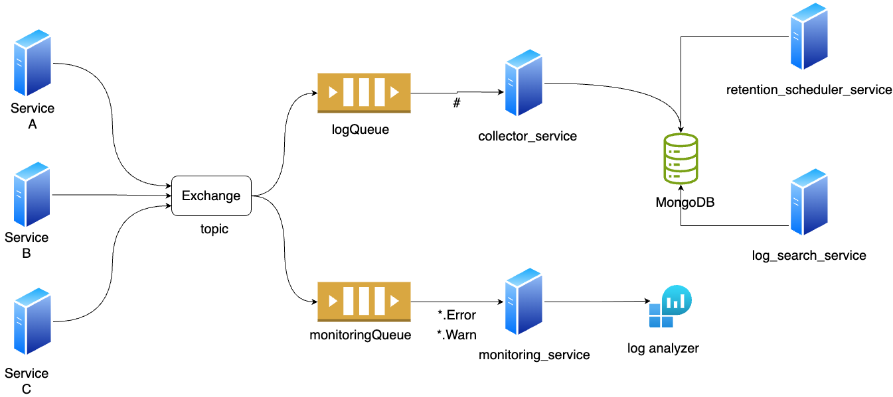

# Log Aggregator

A distributed message-based Log aggregator developed with Python, RabbitMQ, Flask, and MongoDB.  
A Log Aggregator enables you to gather logs from disparate sources into a single system for search, analysis, and actionable insights.

The log aggregator is a distributed system designed to collect, process, and store log data from various services in real-time. It comprises several key components: source_service, collector_service, monitoring_service, search_service, and retention_scheduler_service. These services collaborate to ensure efficient log management, leveraging technologies such as Python, RabbitMQ, Flask, and MongoDB.

The `source_service`(Pub) is responsible for generating log messages from different parts of the application. These logs are published to a RabbitMQ exchange using a topic-based routing pattern, allowing for flexible message distribution. The `collector_service` (Sub) subscribes to relevant topics, consuming all log messages and storing them in a MongoDB database for persistent storage. The `monitoring_service`(Sub) continuously monitors the log streams, analyzing them for error and warning messages only.

The `collector_service` sends an manual acknowledgement to RabbitMQ, Once it has stored the logs in the database and prevent it from being added back onto the queue. If one of the `collector_service` goes down, the same log will be added back to the queue;ready to be consumed by another healthy `collector_service` instance. this exhibits the fault-tolderance of the system.

The `monitoring_service` utilizes `auto_ack=True` parameter which automaticaly acknowledges as the consumer recieves it. RabbitMQ removes the log from the Queue. Even if the code crashes or fails to process the message, RabbitMQ will not re-deliver the message. In this way, Messages are processed faster. Although, It might make sense to send manual acknowledgement here for this service, I have utilized this feature to utilize one of the features of RabbitMQ queues.

By employing a message queue, the publisher is isolated from the consumers. The `source_service` does not contain any information on which services are consuming the data it is publising to the logs_exchange. The system's architecture allows for independent scaling of each service. For instance, multiple instances of the collector_service can be deployed to handle increased log volumes, while additional monitoring_service instances can be introduced to manage higher alerting demands.


## Architecture Overview
<br>




The log aggregator consists of the following key components:

1. **Log Sources**: 
   - Services generate logs in the format: `<timestamp> <service_name> <severity> <log_message>`.
   - Publishes logs to RabbitMQ with routing keys based on log severity and service name.

2. **RabbitMQ Exchange**:
   - Configured for topic-based routing.
   - Routes logs to appropriate queues: `LogQueue` (for storage) and `MonitoringQueue` (for real-time analysis).

3. **Log Collector Service**:
   - Consumes logs from `LogQueue` and stores them in MongoDB.

4. **Monitoring Service**:
   - Consumes logs from `MonitoringQueue` and performs real-time analysis.
   - Detects high error rates and triggers alerts.

5. **Log Search Service**:
   - Provides  RESTful APIs to query logs in mongodb based on parameters like severity and severity

6. **Log Retention Scheduler**:
   - Periodically removes logs older than 10 days from database to maintain storage efficiency.

## Getting Started with Docker
If you have Docker installed in your computer, you do not need to have Python, RabbitMQ or MongoDB installed. You can run all the application with a single command:
  ```bash
  $ docker-compose up
  ```
To scale each component independently, use:
  ```bash
  $ docker-compose up --scale <service-name>=<number-of-containers>
  ```
## Getting Started without Docker
if you do not have docker, you would have to install each of these applications independently and run them. Assuming that you have RabbitMQ and MongoDB running, you would have to open each service, create a virtual environment to install all the required dependencies and then you can start the service. To scale your microservices, you can always spin multiple instances of your microservice in different terminals. 
```bash
$ cd source_service
$ python -m venv env
$ source env/bin/activate
$ pip install -r requirements.txt
$ python source.py
```


